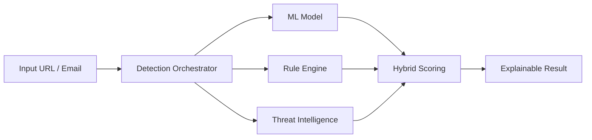
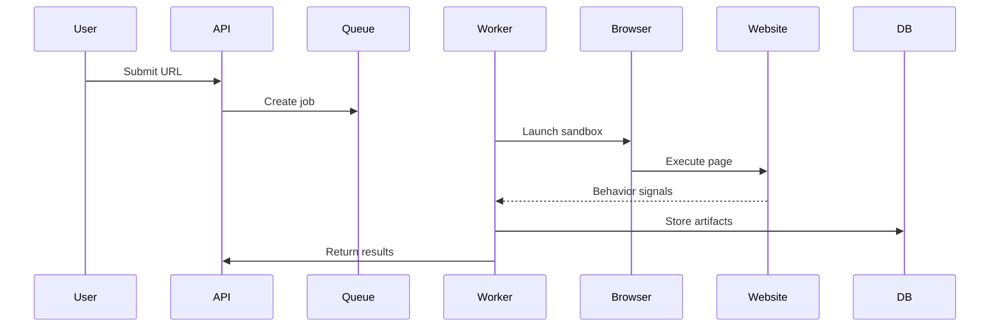
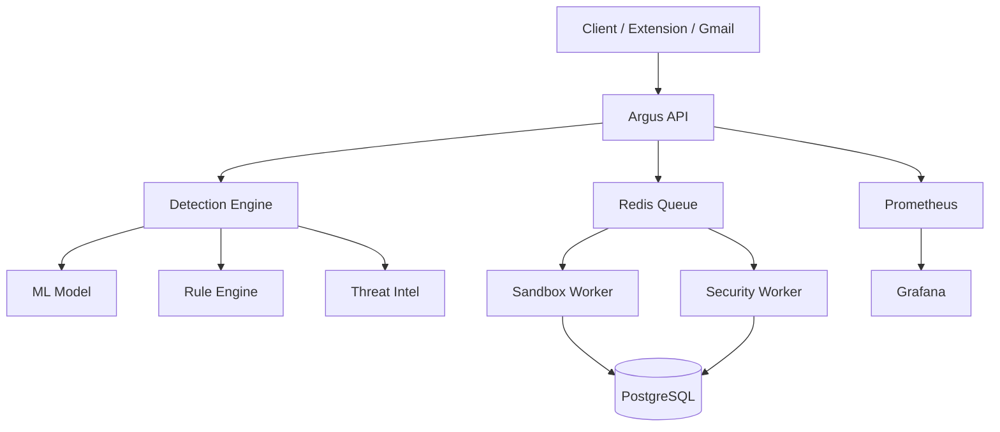
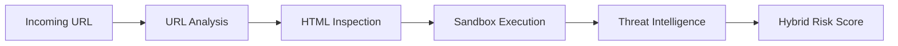

# Argus

<p align="center">
  
</p>

<p align="center">
  
  
  
  
</p>

---

## Overview

Argus is an intelligent phishing detection and web security analysis platform designed to identify malicious websites using a **multi-layer hybrid detection system**.

It combines:

* Machine Learning inference
* Rule-based heuristics
* Threat intelligence
* Dynamic sandbox execution

to deliver **high-confidence, explainable phishing detection** in real time.

---

## Core System (High-Level)



---

## Platform Capabilities

### Detection Engine

* Hybrid scoring (ML + Rules + Threat Intel)
* URL entropy and pattern analysis
* Credential harvesting detection
* Redirect chain tracking
* JavaScript behavior inspection

---

### Visual Impersonation Detection

* Screenshot-based similarity analysis
* Detects phishing clones of major platforms:

  * Google
  * Microsoft
  * AWS
  * PayPal
  * Apple
  * GitHub

---

### Threat Intelligence

* Newly registered domain detection
* Typosquatting analysis
* Homograph attack detection
* Certificate transparency monitoring
* External threat feed ingestion

---

### Sandbox Analysis



* Headless Chromium execution
* Network and redirect tracking
* DOM mutation analysis
* Credential interaction monitoring

---

## System Architecture



---

## Tech Stack

### Backend


### ML & Analysis


### Infrastructure


---

## Detection Pipeline



---

## Project Structure

```
backend/
  app/
    detection/
    ml/
    services/
    workers/

frontend/
  src/

extension/
  chrome-extension/

cli/
  scanphish.py

deploy/
  k8s/

monitoring/
  prometheus.yml
  grafana_dashboard.json
```

---

## Local Development

### Requirements

* Python 3.11
* Docker
* Node.js

### Run Locally

```bash
./scripts/dev_up.sh
```

Access:

* API → http://localhost:8000
* Grafana → http://localhost:3000
* Prometheus → http://localhost:9090

---

## Kubernetes Deployment

```bash
./scripts/k8s_deploy.sh
```

Includes:

* API services
* Workers
* Redis
* PostgreSQL
* Monitoring stack

---

## CLI Scanner

```bash
python cli/scanphish.py https://example.com
```

Returns:

* phishing verdict
* risk score
* detection explanation
* intelligence signals

---

## Observability

Metrics endpoint:

```
/metrics
```

Tracked metrics:

* request throughput
* detection rates
* worker health
* model latency

---

## Security Model

* tenant isolation
* sandbox isolation
* non-root containers
* structured logging
* rate limiting
* authentication

---

## Roadmap

* advanced ML model tuning
* enterprise SSO
* SIEM integrations
* alerting pipelines
* extended threat feeds

---

## License

Research and educational use. Licensing may evolve for production deployment.

---

<p align="center">
  
</p>
