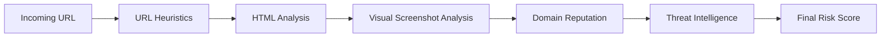
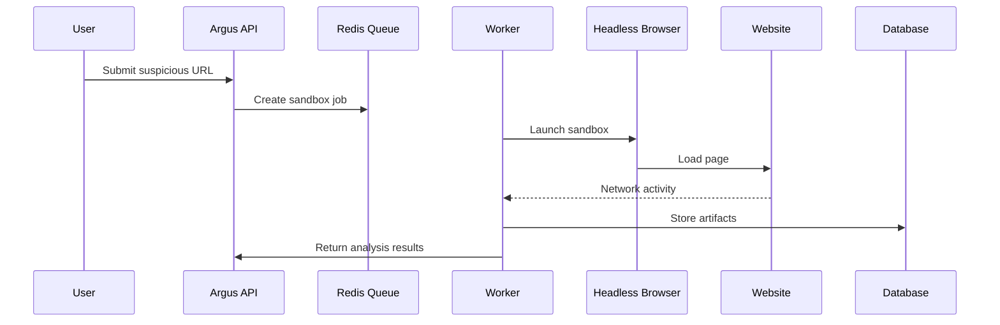
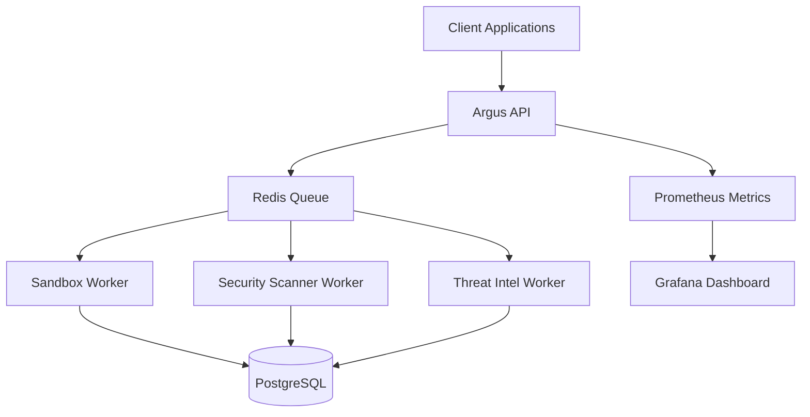

# Argus

Argus is an intelligent phishing detection and web security analysis platform designed to identify malicious websites using a combination of machine learning, threat intelligence, sandbox execution, and distributed monitoring.

The system is built as a modular, multi-tenant security platform capable of operating as a SaaS security service or as a self-hosted phishing detection infrastructure.

Argus combines static analysis, dynamic browser sandboxing, domain intelligence, and developer integrations to provide explainable phishing detection and automated website security analysis.

---

# Project Status


---

# Tech Stack

## Languages


## Backend


## Security & Analysis


## Infrastructure


---

# Core Capabilities

## Phishing Detection

Argus detects phishing websites using a multi-layer detection pipeline.

Signals include:

* URL entropy and keyword analysis
* login form detection
* credential harvesting detection
* obfuscated JavaScript analysis
* redirect chain inspection
* domain reputation scoring

---

## Visual Brand Impersonation Detection

Argus analyzes page screenshots to detect visual similarities with legitimate login portals such as:

* Google
* Microsoft
* AWS
* PayPal
* Apple
* GitHub

This enables detection of phishing pages that mimic trusted services.

---

## Threat Intelligence

Argus integrates domain intelligence signals including:

* certificate transparency monitoring
* newly registered domain detection
* typosquatting detection
* homograph attack detection
* threat feed ingestion

---

## Sandbox Dynamic Analysis

Suspicious websites are executed in an isolated Chromium environment.

The sandbox observes:

* network requests
* redirect chains
* JavaScript execution
* credential submission behavior
* DOM mutations

Artifacts include screenshots and HTML snapshots.

---

# Detection Pipeline

The phishing detection engine processes requests through multiple layers.



---

# Sandbox Execution Workflow



---

# Platform Architecture

Argus is designed using a distributed microservice architecture.



---

# Project Structure

```
backend/
  app/
    main.py
    model.py
    services/
    sandbox/
    workers/
    security_scanner/

frontend/
  src/

cli/
  scanphish.py

deploy/
  k8s/

monitoring/
  prometheus.yml
  grafana_dashboard.json

scripts/
  dev_up.sh
  k8s_deploy.sh
  k8s_delete.sh

docs/
  DEPLOYMENT.md
```

---

# Local Development

Requirements

Python 3.11
Docker
Docker Compose

Run the platform locally:

```bash
./scripts/dev_up.sh
```

Services will start automatically.

API
http://localhost:8000

Grafana
http://localhost:3000

Prometheus
http://localhost:9090

Sandbox artifacts are stored locally in:

```
sandbox_artifacts/
```

---

# Kubernetes Deployment

The platform includes Kubernetes manifests for scalable deployment.

Deploy:

```bash
./scripts/k8s_deploy.sh
```

This creates:

* Argus API deployment
* worker deployments
* Redis
* PostgreSQL
* Prometheus monitoring
* Grafana dashboards
* persistent artifact storage

Remove deployment:

```bash
./scripts/k8s_delete.sh
```

Deployment details:

```
docs/DEPLOYMENT.md
```

---

# CLI Scanner

Argus includes a CLI phishing detection tool.

Example:

```bash
python cli/scanphish.py https://example.com
```

The CLI returns:

* phishing verdict
* risk score
* domain intelligence signals
* detection explanation

The CLI can also be integrated into CI pipelines.

---

# Observability

Argus exposes operational metrics at:

```
/metrics
```

Metrics include:

* scan request counts
* phishing detection totals
* worker health metrics
* sandbox execution statistics
* model inference latency

Prometheus collects metrics and Grafana visualizes the system health.

Alert rules monitor:

* worker failures
* queue backlog
* model latency spikes
* phishing detection anomalies

---

# Security Design

Argus follows security-first engineering practices.

Key protections include:

* non-root container execution
* strict tenant isolation
* sandbox isolation for untrusted pages
* structured security event logging
* worker health monitoring
* rate limiting and API authentication

---

# Roadmap

Future improvements include:

* automated ML training pipeline
* analyst feedback labeling
* enterprise alerting integrations
* SIEM export support
* advanced visual impersonation detection

---

# License

This project is intended for research and educational purposes. Licensing terms may be defined in the future depending on distribution and use.
